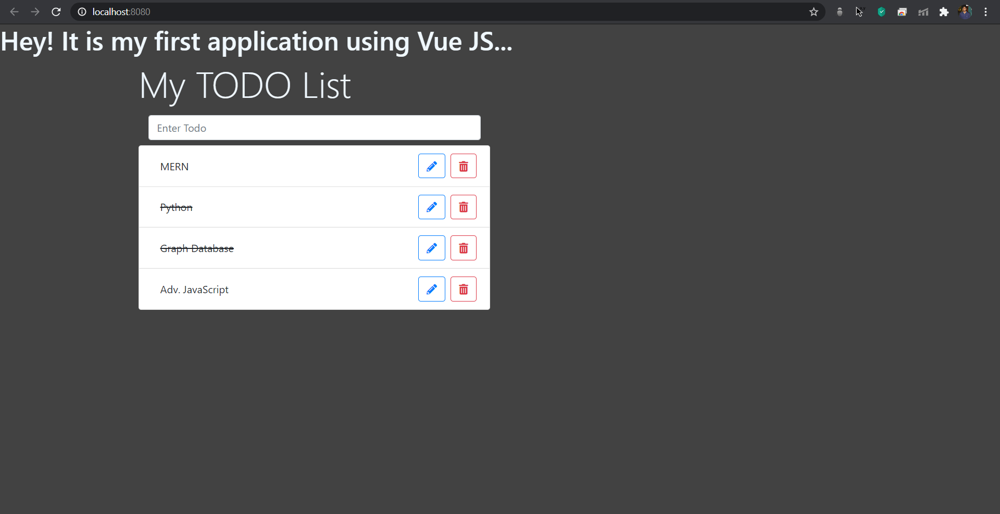

# My Todo Application

## Output screen looks like



This is my Todo List where I can maintain a course list what I want to complete in the upcoming days and the completed one is dashed with a line on it. I can edit the name of the course in the list and also delete the courses which are not required further.

## Project setup
```
npm install
```

### Compiles and hot-reloads for development
```
npm run serve
```

### Compiles and minifies for production
```
npm run build
```

### Lints and fixes files
```
npm run lint
```

### Customize configuration
See [Configuration Reference](https://cli.vuejs.org/config/).
